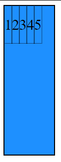

# POC 1: Flexbox
### Um código que explica e ensina as propriedades principais de Flexbox em CSS.

## Descrição
Este é um código simples HTML com CSS que demonstra as propriedades de Flexbox com demonstrações de código e dos resultados na própria página.
Flexbox oferece um jeito dinâmico de organizar itens em um container com CSS. Um método capaz de organizar espacialmente os elementos em uma interface.
Há diversas propriedades que são exploradas neste código.

### display: flex
Esta propriedade escolhida em um container fará seus conteúdos se organizarem de acordo com as opções Flexbox incluídas no resto do código.

### flex-direction
Em um container com flex, podemos utilizar flex-direction para modificar a direção em que se organiza. O valor padrão é "row".

Isto irá organizar os itens do container em uma linha.

Há também a opção inversa, row-reverse, que organiza os itens em uma linha em ordem inversa.

Pode-se organizar os itens verticalmente substituido a opção por "column".

E há a opção inversa "column-reverse".

### flex-wrap
Podemos utilizar "flex-wrap" para garantir que, se não houver espaço na linha em que o container está, ele irá colocar o resto na próxima linha. O valor padrão, sem wrap, é "nowrap".

A opção inversa "wrap-reverse" funciona da mesma forma, mas joga para a linha contrária.

### flex-flow
Para organizar o código, podemos condensar as opções "flex-direction" e "flex-wrap" em uma única linha com a propriedade "flex-flow".

### justify-content
Podemos organizar a posição dos itens dentro do container, de forma que vão se organizar conforme o container muda de tamanho. 

> flex-start

Com "flex-start" os itens serão jogados para o ponto inicial da direção escolhida com "flex-direction".

> flex-end

Com "flex-end" os itens serão jogados para o ponto final da direção escolhida com "flex-direction".

> center

Com "center" os itens serão jogados para o centro da linha no container.

> space-between

Com "space-between" os itens serão distribuídos de forma consistente na linha, com o primeiro no início da linha e o último no fim da linha.

> space-around

Com "space-around" os itens serão distribuídos de forma consistente na linha, com espaços similares entre cada item.

> space-evenly

Com "space-evenly" os itens serão distribuídos de forma consistente na linha, com espaços iguais entre cada item.

### align-items

Há também uma forma de organizar os itens internos no outro eixo, que também depende da direção configurada.

> flex-start

Com "flex-start" os itens serão jogados para o ponto inicial do eixo.

> flex-end

Com "flex-end" os itens serão jogados para o ponto final do eixo.

> center

Com "center" os itens serão jogados para o centro do eixo no container.

> stretch

Com "stretch" os itens serão esticados para encaixar no eixo, obedecendo limites de tamanho.

> baseline

Com "baseline" os itens serão jogados para o eixo central que o texto segue.

### gap

Podemos controlar o espaço entre itens no container com a propriedade "gap".

Existem propriedades específicas. "row-gap" para controlar o espaço vertical, e "column-gap" para o horizontal. Mas utilizar "gap" permite condensar os dois em uma linha.

## Linguagem
Este projeto utiliza um arquivo em HTML (index.html), um arquivo em CSS (style.css) e imagens que são utilizadas pelo arquivo HTML. No repositório está também este arquivo explicativo em Markdown (README.md).

## Design
O design do arquivo é simples para garantir que seja fácil de abrir e executar, e para fácil compreensão e demonstração dos itens relevantes. Os itens relevantes são marcados claramente na página.

## Como executar
Para executar este código, utilize a opção do Github que permite baixar o repositório em um arquivo compactado .zip.

[Imagem mostrando onde está o botão](https://prnt.sc/w8KYZsB4wUDH)

Quando o arquivo estiver baixado, extraia seu conteúdo em uma nova pasta ou uma pasta vazia. Confira que todos os itens do repositório estão na pasta com o arquivo principal (index.html e styles.css).

*Extrair o arquivo em uma pasta vazia ou nova garante que nenhum arquivo exterior irá impedir a execução do código ou atrapalhar seu funcionamento*

Finalmente, abra o arquivo __index.html__ em um navegador como Edge ou Chrome. Se os passos anteriores foram seguidos corretamente, a página irá abrir no navegador selecionado.
